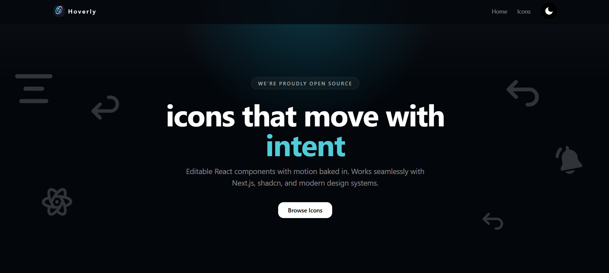

# Hoverly

Animated icon library built with React and Motion. Icons designed to move with intent, not decoration.



## Features

- **Motion-first design** - Every icon animates on interaction, built with motion/react
- **React components** - Drop-in components that work with Next.js, shadcn, and modern tooling
- **Fully customizable** - Copy the source, modify animations, adjust stroke width and colors
- **Open source** - Community owned

## Quick Start

### Via CLI

```bash
npx shadcn@latest add https://hoverly.com/r/[icon-name].json
```

### Manual Installation

1. Install dependencies:

```bash
npm install motion
```

2. Copy any icon component from the `src/icons/` directory into your project

3. Import and use:

```tsx
import GithubIcon from "@/icons/github-icon";

export default function Example() {
  return <GithubIcon className="h-6 w-6" />;
}
```

## Tech Stack

- Next.js 16 (App Router)
- React 19
- motion for animations
- Tailwind CSS 4
- shadcn/ui components
- Biome (Linting & Formatting)

## Development

```bash
# Install dependencies
pnpm install

# Start dev server
pnpm dev

# Build for production
pnpm build

# Check for linting errors
pnpm lint

# Format code
pnpm format
```

## Project Structure

```bash
hoverly/
├── src/
│   ├── app/                    # Next.js App Router pages
│   ├── components/             # UI components
│   ├── icons/                  # Animated icon components
│   └── lib/                    # Utilities
├── scripts/                    # Build scripts for registry
├── public/                     # Static assets
└── registry.json               # shadcn registry configuration
```

## Contributing

Contributions welcome. Each icon follows this pattern:

1. SVG wrapped in a React component
2. Animation triggered on hover using motion/react
3. Exported with ref forwarding for imperative control

Check out our [Contributing Guide](CONTRIBUTING.md) to get started!

## Links

- Website: [hoverly.com](https://hoverly.com) (WIP)
- GitHub: [github.com/Pratham-Prog861/hoverly](https://github.com/Pratham-Prog861/hoverly)

## Creator

Built by [Pratham-Prog861](https://github.com/Pratham-Prog861)

## Code of Conduct

Please note that this project is released with a [Contributor Code of Conduct](CODE_OF_CONDUCT.md). By participating in this project you agree to abide by its terms.

## License

[MIT License](LICENSE)
